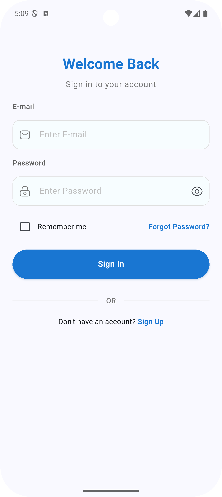
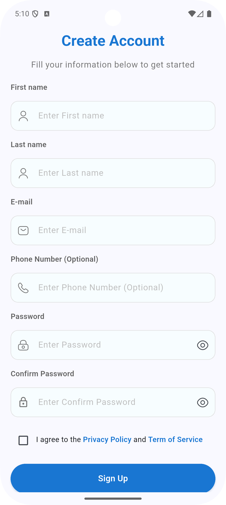
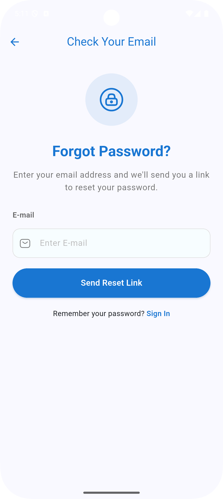

# Flutter Firebase Authentication

## Core Features
* Firebase Authentication - Email/Password signup and login
* Firestore Integration - User data storage and retrieval
* Riverpod State Management - Clean, reactive state handling
* Form Validation - Validates all user input: Email, Password, Phone, Name, and all mandatory field validation
* Email Verification Flow - Complete email verification process. Sends verification email automatically and auto-checks verification status and shows success message
* User Profile Management - Edit and update user information
* Internet connectivity check - Network validation before operations.

## Getting Started
1. Set up Firebase using FlutterFire CLI: 
    ``` 
   flutterfire configure
   ```
2. Add dependencies from the provided `pubspec.yaml`
3. Enable Email/Password authentication in Firebase Console
4. Set up Firestore with the provided security rules
5. Run the app:
    ``` 
    flutter pub get
    flutter run
    ```
### Screenshots



